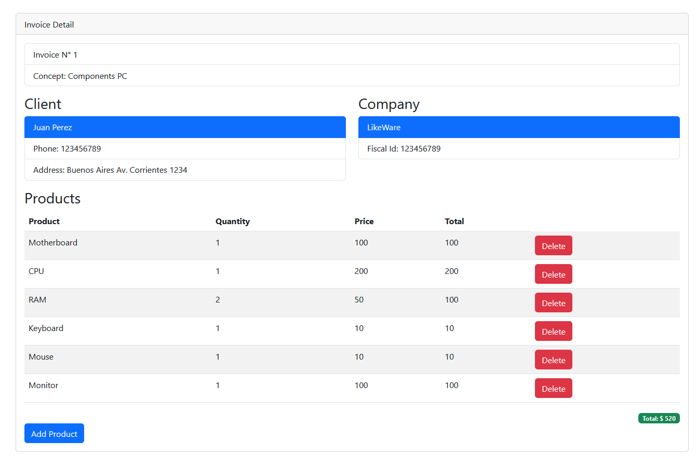
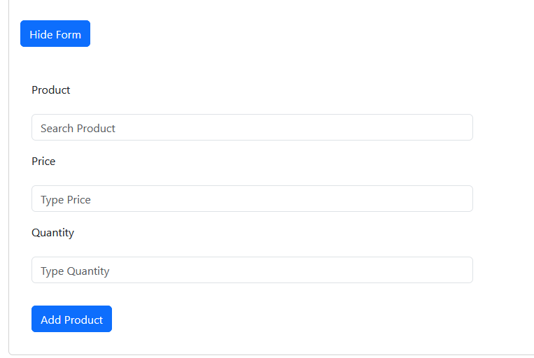
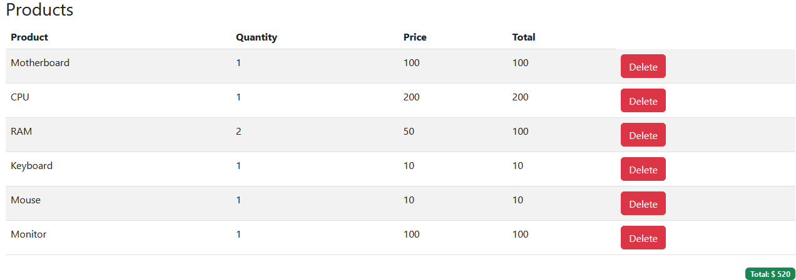

# Factura App en React 🧾

¡Bienvenido a la Factura App en React! Esta es una aplicación de factura que te permite listar productos, calcular el total, agregar nuevos productos y eliminarlos. ¡Es perfecta para practicar tus habilidades en React! 😄

**Nota importante**: Los datos utilizados en esta aplicación son ficticios, ya que no contamos con un backend. La aplicación está diseñada para fines de aprendizaje y demostración.


## Capturas de Pantalla 📸

Aquí tienes algunas capturas de pantalla de la aplicación en acción:

- **Página de inicio:**



- **Añadir Producto:**



- **Lista de Productos:**




## Cómo Clonar y Ejecutar 🚀

Sigue estos sencillos pasos para clonar y ejecutar el proyecto en tu máquina:

1. **Clona el Repositorio:**
   ```bash
   git clone https://github.com/bardolog1/factura-app.git
   ```

2. **Ingresa al Directorio del Proyecto:**
   ```bash
   cd factura-app
   ```

3. **Instala las Dependencias:**
   ```bash
   npm install
   ```

4. **Inicia la Aplicación con Vite:**
   ```bash
   npm run dev
   ```

¡Listo! La aplicación estará disponible en tu navegador en [http://localhost:3000](http://localhost:5173).

## Vista en Tiempo Real 🚀

Puedes ver la aplicación en tiempo real en [https://invoiceapp-react.netlify.app](https://invoiceapp-react.netlify.app). ¡Diviértete explorando y creando facturas! 😃

## Contribución y Reporte de Errores 🤝

Si encuentras algún error o tienes ideas para mejorar esta aplicación, no dudes en abrir un problema o enviar una solicitud de extracción. ¡Estamos abiertos a colaboraciones!

## Licencia 📝

Este proyecto está bajo la licencia MIT. Siéntete libre de usar, modificar y distribuir este código como desees. Consulta el archivo [LICENSE](LICENSE) para obtener más información.

¡Esperamos que disfrutes utilizando la Factura App en React! Si tienes alguna pregunta, no dudes en contactarnos. ¡Feliz facturación! 🤑🧾🎉
